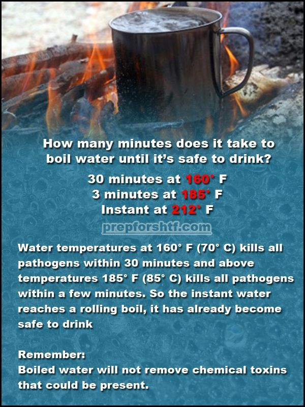
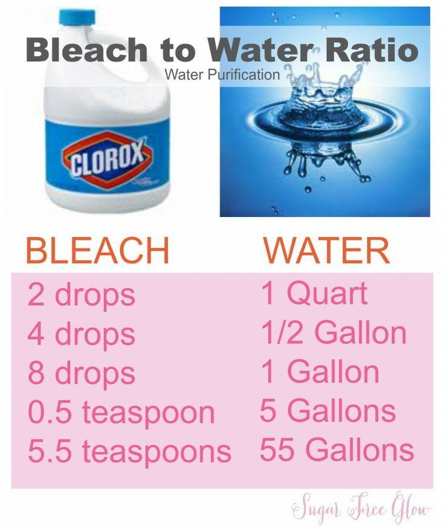

parent:: [[0 - Water]]
prev:: [[3 - Distillation]]
next:: [[5 - Filtration]]

---

#water  

https://inspectapedia.com/water/Drinking_Water_Purification.php

https://wwwnc.cdc.gov/travel/yellowbook/2020/preparing-international-travelers/water-disinfection

- # Survival
	- ## Know-How
		- Images
			- 
	- Using Twigs
		- How to disinfect water in the forest
			- Water disinfect: pine, juniper, fir, cedar.
			  15-20 grams of young broken twigs, per 1 liter of water (add to the boiling water and allow to cool and stand), at the bottom there is a sediment, similar to small flakes - it is dirt, do not use it.
			- Oak, beech, willow, willow and birch have a huge supply of tannins that destroy microbes, various fungi and most viruses.
			- To disinfect, do the same thing, 15-20 grams of the bark of these shrubs per 1 liter, boil for about 30 minutes, or you can just insist in warm water for 6-8 hours.
# Basics
- ### [[Iodine]]
	- 5 drops (0.25 mL) of iodine to 1 litre of water. 
	- 20 drops (1mL) per 1 gallon (4 litres)
	- Mix the iodine and water together. 
	- Let stand for at least 30 minutes before drinking.
- ### [[Hydrogen Peroxide]]
	- 10 drops (.5 mL) per 1 litre
	- 40 drops (2mL) of 3% hydrogen peroxide to 1 gallon
- #### Bleach/Chlorine
	- 2 drops of bleach to 1 litre of water
	- Mix the water very well and let it stand for 30 minutes. 
	- If there is a slight chlorine smell and the water looks clear, it’s safe to drink.
	- Images
		- 

### Table 2-07. Comparison of water disinfection techniques

| TECHNIQUE | ADVANTAGES | DISADVANTAGES |
| --------- | ---------- | ------------- |
|Heat | -   Does not impart additional taste or color - Single step that inactivates all enteric pathogens - Efficacy is not compromised by contaminants or particles in the water as for chemical disinfection and filtration | -   Does not improve taste, smell, or appearance of source water - Fuel sources may be scarce, expensive, or unavailable - Does not prevent recontamination during storage|

Filtration

-   Simple to operate
-   Requires no holding time for treatment
-   Large choice of commercial product designs
-   Adds no unpleasant taste and often improves taste and appearance of water
-   Can be combined with chemical disinfection to increase microbe removal

-   Adds bulk and weight to baggage
-   Many filters do not reliably remove viruses
-   More expensive than chemical treatment
-   Eventually clogs from suspended particulate matter and may require some field maintenance or repair
-   Does not prevent recontamination during storage

Chlorine,  
iodine,  
electrolytic  
solutions

-   Inexpensive and widely available in liquid or tablet form
-   Taste can be removed by simple techniques
-   Flexible dosing
-   Equally easy to treat large and small volumes
-   Will preserve microbiologic quality of stored water

-   Impart taste and odor to water
-   Flexible dosing requires understanding of principles
-   Iodine is physiologically active, with potential adverse effects
-   Not readily effective against _Cryptosporidium_ oocysts
-   Efficacy decreases with cloudy water
-   Corrosive and stains clothing

Chlorine dioxide

-   Low doses have no taste or color
-   Simple to use and available in liquid or tablet form
-   More potent than equivalent doses of chlorine
-   Effective against all waterborne pathogens, including _Cryptosporidium_

-   Volatile and sensitive to sunlight: do not expose tablets to air, and use generated solutions rapidly
-   No persistent residual concentration, so does not prevent recontamination during storage

Ultraviolet (UV)

-   Imparts no taste
-   Portable battery-operated devices now available
-   Effective against all waterborne pathogens
-   Extra doses of UV can be used for added assurance and with no side effects

-   Requires clear water
-   Does not improve taste or appearance of water
-   Relatively expensive (except solar disinfection [SODIS])
-   Requires batteries or power source (except SODIS)
-   Cannot know if devices are delivering required UV doses
-   No persistent residual concentration, so does not prevent recontamination during storage

### Table 2-08. Microorganism size and susceptibility to filtration

| ORGANISM | AVERAGE SIZE (µm) | MAXIMUM RECOMMENDED FILTER RATING (µm ABSOLUTE) |
| -------- | ----------------- | ----------------------------------------------- |
| Viruses | 0.03 | Not specified (optimally 0.01, ultrafiltration) | 
|Enteric bacteria (_Escherichia coli_)|0.5 ×2–8 | 0.2–0.4 (microfiltration)|
|Cryptosporidium_ oocyst|4–6|1 (microfiltration)|
|Giardia_ cyst|8 × 19|3.0–5.0 (microfiltration)|
|Helminth eggs|30 × 60|Not specified; any microfilter|
|Schistosome larvae|50 × 100|Not specified; any microfilter|

### CHOOSING A DISINFECTION TECHNIQUE

[Table 2-09](https://wwwnc.cdc.gov/travel/yellowbook/2020/preparing-international-travelers/water-disinfection#table209) summarizes advantages and disadvan­tages of field water disinfection techniques and their microbicidal efficacy. It is advisable to test a method before travel.

### Table 2-09. Summary of field water disinfection techniques

 

BACTERIA

VIRUSES

PROTOZOAN CYSTS (_GIARDIA_/  
AMEBAS)

CRYPTOSPORIDIA

HELMINTHS/  
SCHISTOSOMES

Heat

+

+

+

+

+

Filtration

+

+/-1

+

+

+

Halogens

+

+

+2

-

+/-3

Chlorine dioxide

+

+

+

+

+

1Most filters make no claims for viruses. Hollow-fiber filters with ultrafiltration pore size and reverse osmosis are effective.  
2Require higher concentrations and contact time than for bacteria or viruses.  
3Eggs are not very susceptible to halogens, but risk of waterborne transmission is very low.