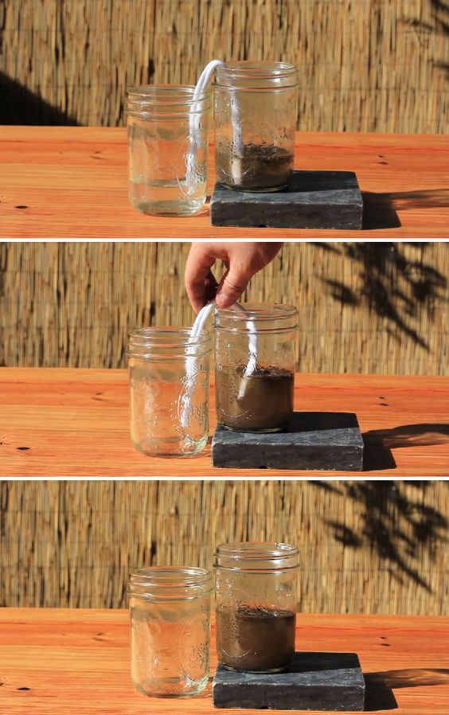

root:: [[0 - Water]]
prev:: [[4 - Disinfection]]

---

#water 


# Survival
- #### Nature-based gravity filter
	- Images
		- 
		- 
		- 
		- 
		
		
# Survival
- Levels
	- Rocks/Pebbles
	- Coarse Sand
	- Charcoal
	- Fine Sand
	- Gravel
	- Twigs
- #### Slow Cloth Filter
		- images
			- 
			- 
	- #### Stills
		- images
			- 


# Pre-Made Systems
## Survival

###### Lifestraw
- Costco

## Countertop

##### Berkey
- Black Carbon filters are NOT "infused" with silver - they are empty. They are rip-offs from [Doulton](http://doultonusa.com/HTML%20pages/imperial_superS_candle.htm) 
	- Silver infused actually looks like:

=== start-multi-column: ExampleRegion1  
```column-settings  
number of columns: 2  
largest column: left  
```

![[5 - Filtration-1658434401866.jpeg]]

=== end-column ===

Text displayed in column 2.

=== end-multi-column


###### Travel
- Knock off of [BRITISH BERKEFELD filer system](https://purennatural.com/products/british-berkefeld-doulton-gravity-water-filter)
- [Doulton Ceramic "Candle"](https://purennatural.com/products/doulton-super-sterasyl-ceramic-filter-elements) fits Berkey system


## Under Sink


## In Plumbing

