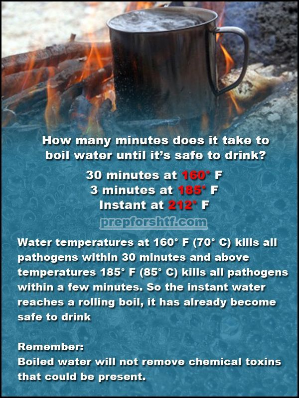
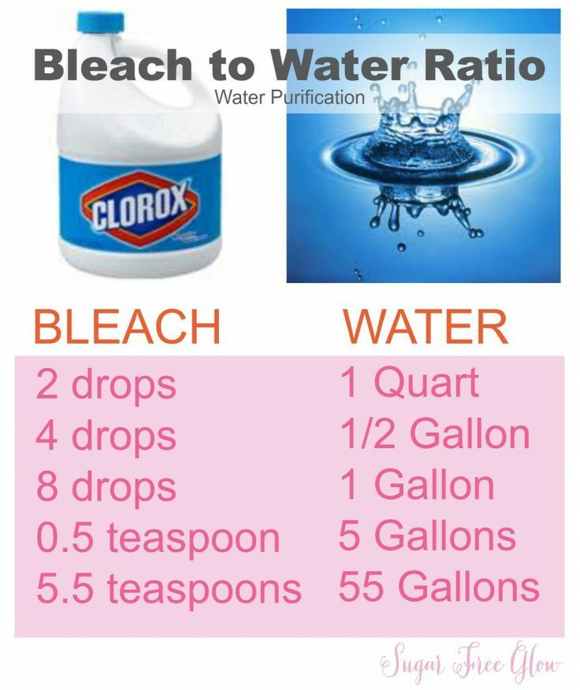

#water  

- # Survival
	- ## Know-How
		- Images
			- 
	- Using Twigs
		- How to disinfect water in the forest
			- Water disinfect: pine, juniper, fir, cedar.
			  15-20 grams of young broken twigs, per 1 liter of water (add to the boiling water and allow to cool and stand), at the bottom there is a sediment, similar to small flakes - it is dirt, do not use it.
			- Oak, beech, willow, willow and birch have a huge supply of tannins that destroy microbes, various fungi and most viruses.
			- To disinfect, do the same thing, 15-20 grams of the bark of these shrubs per 1 liter, boil for about 30 minutes, or you can just insist in warm water for 6-8 hours.
- # Basics
	- ### Chemical
		- #### Bleach/Chlorine
			- 2 drops of bleach to 1 litre of water
			- Mix the water very well and let it stand for 30 minutes. 
			- If there is a slight chlorine smell and the water looks clear, it’s safe to drink.
			- Images
				- 
		- ### Iodine
			- 5 drops (0.25 mL) of iodine to 1 litre of water. 
			- Mix the iodine and water together. 
			- Let stand for at least 30 minutes before drinking.

